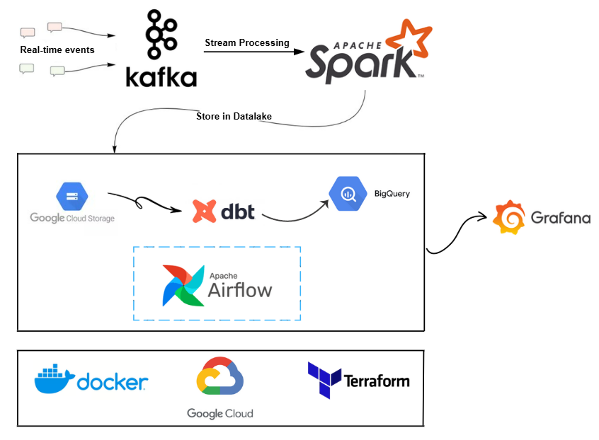
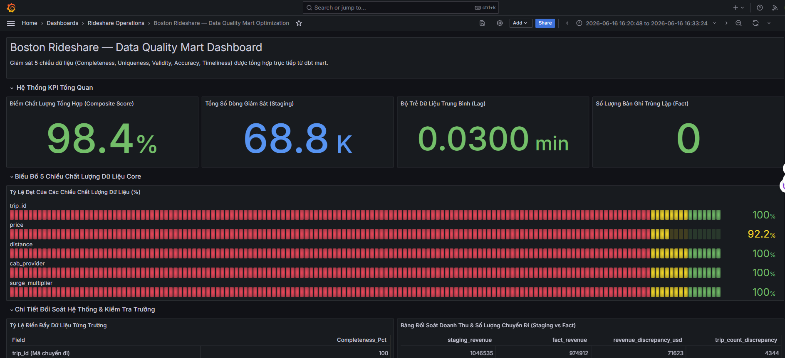

# Boston Rideshare Real-Time Analytics Platform

A production-grade streaming analytics pipeline simulating real-time Uber & Lyft ride events in Boston — built as a portfolio project demonstrating the modern data engineering stack end-to-end.

---
## Overview
The pipeline is designed to:

Extract real-time rideshare event streams from Apache Kafka using Python.

Store the raw data as incremental Parquet files in a Google Cloud Storage (GCS) bucket via PySpark Streaming.

Transform and model the data using dbt Core and Google BigQuery.

Load the transformed metrics into a Data Quality Mart for real-time visualization and observability on Grafana.

---
## Architecture



---

## Tech Stack

| Layer | Technology |
|---|---|
| Ingestion | Python CSV Producer, Apache Kafka 3.7.0 |
| Processing | Apache Spark 3.5 |
| Data Lake | Google Cloud Storage |
| Data Warehouse | BigQuery |
| Transformation | dbt Core |
| Orchestration | Apache Airflow |
| Visualization | Grafana |
| Infrastructure | Docker Compose, Terraform |
| Language | Python 3.11 |

---

## Dataset

[Uber & Lyft Dataset — Boston, MA](https://www.kaggle.com/datasets/brllrb/uber-and-lyft-dataset-boston-ma)

---

## Project Structure

```
Taxitrip/
├── kafka/
│   ├── producer.py          
├── dbt/
│   ├── models/
│   │   ├── staging/         
│   │   ├── core/    
│   │   └── marts/           
│   ├── tests/               
│   ├── dbt_project.yml
│   └── profiles.yml
├── credentials/
│   └── gcp-key.json
├── airflow/
│   └── dags/
│       └── rideshare_pipeline.py 
├── grafana/
│   └── dashboards/
│       └── Dashboard.json
├── terraform/
│   ├── main.tf         
│   └── variables.tf
├── spark/
│   └── job/
└── docker-compose.yml
```
## Data Pipeline 
1. Ingestion: A Python producer reads raw CSV rideshare data and pushes events to a Kafka topic. Kafka UI can be used for monitoring.

2. Processing: A PySpark Streaming job consumes events from Kafka, performing real-time processing and cleaning.

3. Storage: Spark writes the processed data in Parquet format, including checkpoints, into GCS.

4. Transformation: Airflow triggers dbt models that run directly on BigQuery.

5. Observability: Grafana queries the dbt-transformed Data Quality Mart in BigQuery to visualize real-time data, including State Timelines.
---

## Quick Start

### Prerequisites

- Docker & Docker Compose
- GCP project with BigQuery + GCS enabled
- Service account key (`credentials/gcp-key.json`)

### 1. Clone & configure

```bash
git clone https://github.com/<your-username>/Taxitrip.git
cd Taxitrip
cp .env.example .env
```

### 2. Provision GCP infrastructure

```bash
cd terraform
terraform init && terraform apply 
# Sau khi docker-compose up -d xong, terraform apply 1 lần nữa
```

### 3. Start services

```bash
docker-compose up -d
```

### 4. Open Airflow

Navigate to `http://localhost:8080`


### 5. Open Grafana

Navigate to `http://localhost:3000`

---

## Dashboard Overview




